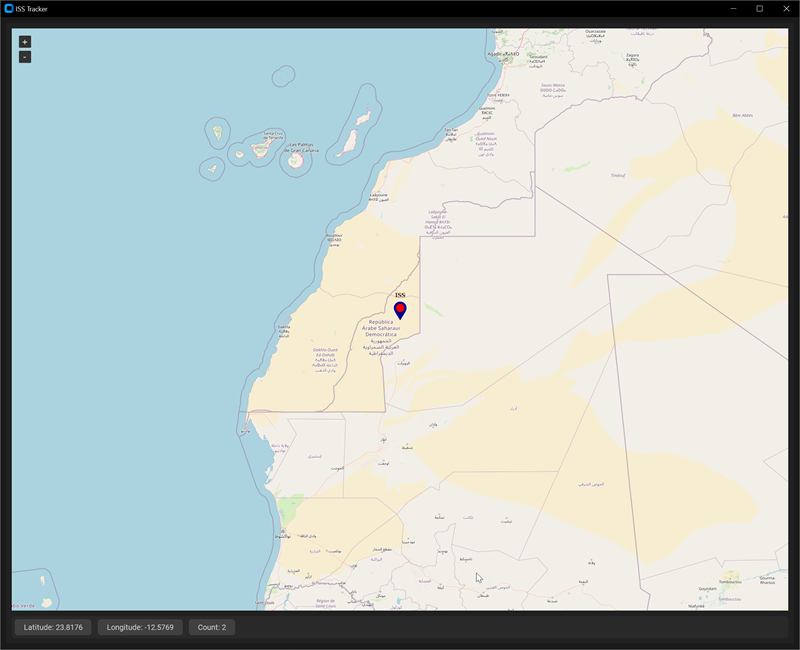

# ISS (International Space Station) Tracker

## Overview

- Python3 [CustomTkinter](https://customtkinter.tomschimansky.com/)
- [Tkintermapview](https://github.com/TomSchimansky/TkinterMapView)

## Changes

- 12/04/2024: Added CustomTkinter custom horizontal spinbox to change update interval
- 11/30/2024: Added surface weather from [Open-Meteo](https://open-meteo.com/en/docs)
- 11/18/2024: Added line between locations, added ability to change update interval
- 11/09/2024: Initial commit

## License

 This work is licensed under a <a rel="license" href="http://creativecommons.org/licenses/by-nc-sa/4.0/">Creative Commons Attribution-NonCommercial-ShareAlike 4.0 International License</a>.

Copyright (c) 2024 William A Loring
